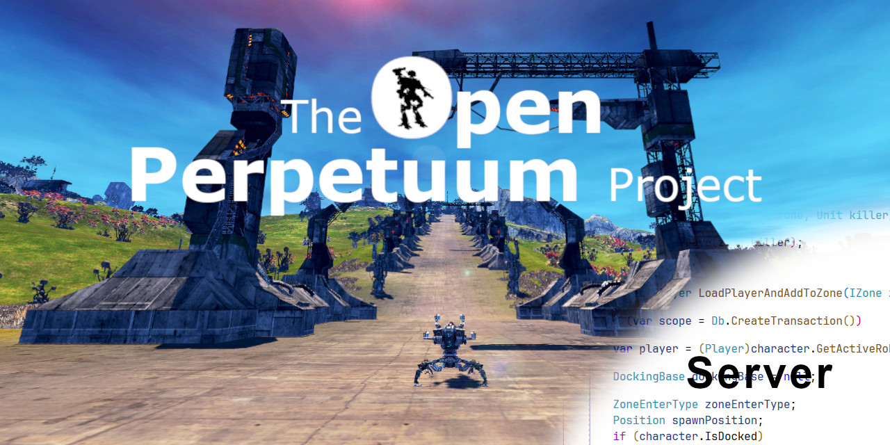

# The Open Perpetuum Server
This is a fork of the Official Perpetuum Server as released by Avatar Creations [here](https://github.com/PerpetuumOnline/PerpetuumServer).  
This server is developed under the direction of the [Open Perpetuum Project](https://openperpetuum.com) game design and development team; a 100% volunteer opensource player development and persistent Perpetuum Server hosting project.

To join the Team, find our call for volunteers on our website [here!](https://openperpetuum.com/volunteer-tech) where you will also find our [Volunteer Survey](https://forms.gle/V7B5zNAFCFmSLLxt6).

If you have any questions about joining the team hit us up on [discord](https://discord.gg/e4gH9Ff)!

To see what we are working on acquaint yourself with our:
 - Website [https://openperpetuum.com](https://openperpetuum.com)
 - Project Kanban [Board](https://github.com/orgs/OpenPerpetuum/projects/2)
 - [Discord](https://discord.gg/e4gH9Ff)

To contribute, join the team and we will get you up and running, or, show us your moxie and submit a pull request!

# How to setup for development?
You need to clone this repository and 2 others (database, asset).

The PerpetuumServer handle server communication with the client.

The OPResource is an asset host that the client access when connecting to a server, the address can be configured in the data folder in the ini file.

The OPDB is contains the database schema definition and the migration patches for each release.

## Getting the source and the necessary files
1. Clone this repository (github page: [here](https://github.com/OpenPerpetuum/PerpetuumServer)) (folder/PerpetuumDedicated)
2. Clone the OPDB repository (github page: [here](https://github.com/OpenPerpetuum/OPDB)) (folder/OPDB)
3. Clone the asset respo (github page: [here](https://github.com/OpenPerpetuum/OPResource)) (folder/OPResource)
4. Get official Perpetuum Dedicated server installer, depot ID (with steamcmd): **693061**
    - (steam) Library -> Home -> Above search select *Tools*, search for *PerpetuumDedicated*, install it
5. Get layers archive and icons, available in a public google drive folder [here](https://drive.google.com/drive/folders/1V6Dnytm0eZCuA_2PZHeUGslNzPrmXKtD)
Note that the Gamma_layers is compatible with release P26+

Here save the layers rar file + icons zip file.

6. (Requires Windows for now) Run the PerpetuumDedicated from steam or directly the exe, install SQL server express (known issues with Win11+, unable to install, use windows 10 to install), initialize the DB when asked at the end.

At this point, take note of the path of the installed server, usually `C:\PerpetuumDedicated`.

## Move/extraction of files
1. Extract layers archive into the data folder of the PerpetuumDedicated installation
2. Extract icons from the archive to the `OPResource/lang0000` folder.

Note that the icons archive does not contain icons for new items, the resource server will substitute with the [default icon](https://github.com/OpenPerpetuum/OPResource/blob/dev/lang0000/icons/default/00000000.png) instead.

## Initialize/Reset DB (windows)
Here you can run the following steps to initialize for the first time or reset the DB to a valid state for the given release version you have checked out in the OPDB repository.

1. Run the file `OPDB/apply_all.bat` to reset the DB (wipe data and restore valid version)
The script is running a background script for each release we have.

## Run the server
You need to have asset hosting, database hosting, server hosting.

This section is an example to do the setup locally on windows 10 but also work on windows 11.

1. Asset host, run node server on the `index.js` from the `OPResource` repository.
2. Database host, should already be setup with windows and SQL Server Express.
3. Server host (debug): Using visual studio running the PerpetuumServer project.

## Client setup
1. Open the game
2. Click on `Server list`
3. Click on `Add private server`
4. Enter the name ex: `local`
5. Enter the server address ex: `127.0.0.1`
6. Click on connect
7. Default credential for local developement is defined in the `OPDB/apply_all.bat` (test/test)
This account have admin access of the local server

## In-game admin commands
The admins commands are defined in this file: `src/Perpetuum/Commands.cs`

Note:
This is a divergent fork and changes within may not be generally applicable outside of the Open Perpetuum Project.  

Open Perpetuum does not provide technical support and is in no way affiliated with Avatar Creations.  
**Use at your own risk.**  See LICENSE for details.
